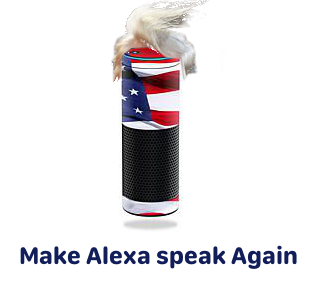

# Alexa Trump 

Amazon **Echo**(a.k.a Alexa) that says random quotes about an specific topic by asking:

**Alexa:** ask Trump about *something*.

Quotes are built by using natural language processing to categorize words and build the sentences using a [Markov chain](https://en.wikipedia.org/wiki/Markov_chain). 

This doesn't represent Trump in any way, i don't care a hell about him or politics in general, i think it's just a
funny experiment to experiment with AI algorithms.

